# 6. UML models

Every diagram is Mermaid. All of them are rendered with `mmdc` before commit (see [10-test-plan.md](10-test-plan.md), T-DOC-01).

| § | Diagram | UML kind |
|---|---|---|
| 6.1 | Domain model | class (conceptual) |
| 6.2 | Components | component |
| 6.3 | Deployment | deployment |
| 6.4 | Packages | package |
| 6.5 | Design classes: server, tiers, client, review | class (design) |
| 6.6 | Sequences: checkout, commit, blame, landing, restricted fetch, post-merge revert, ingestion, status, a ref move on Spanner, a superfan agent's investigation | sequence |
| 6.7 | States: change request, landing request, post-merge job, working-copy file, cached object | state machine |
| 6.8 | Activities: landing, deriving data, status | activity |
| 6.9 | Metadata store | entity-relationship |
| 6.10 | Metadata store on Spanner: keys and indexes | entity-relationship |

---

## 6.1 Domain model

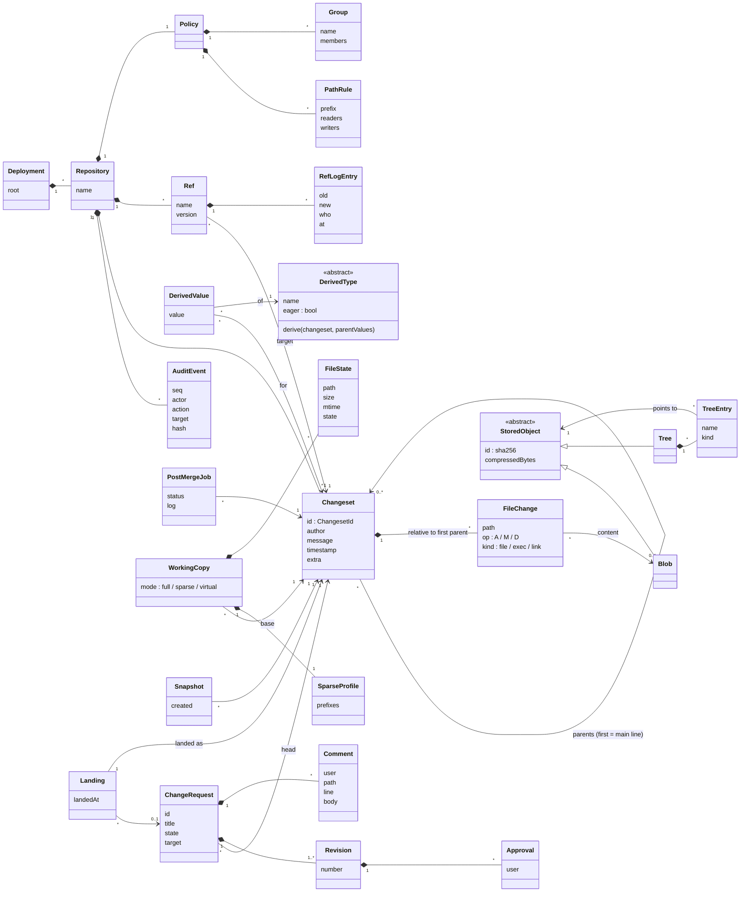
```mermaid
classDiagram
  direction LR
  class Deployment {
    root
  }
  class Repository {
    name
  }
  class AuditEvent {
    seq
    actor
    action
    target
    hash
  }
  class Changeset {
    id : ChangesetId
    author
    message
    timestamp
    extra
  }
  class FileChange {
    path
    op : A / M / D
    kind : file / exec / link
  }
  class StoredObject {
    <<abstract>>
    id : sha256
    compressedBytes
  }
  class Blob
  class Tree
  class TreeEntry {
    name
    kind
  }
  class Ref {
    name
    version
  }
  class RefLogEntry {
    old
    new
    who
    at
  }
  class DerivedType {
    <<abstract>>
    name
    eager : bool
    derive(changeset, parentValues)
  }
  class DerivedValue {
    value
  }
  class Policy
  class PathRule {
    prefix
    readers
    writers
  }
  class Group {
    name
    members
  }
  class ChangeRequest {
    id
    title
    state
    target
  }
  class Revision {
    number
  }
  class Approval {
    user
  }
  class Comment {
    user
    path
    line
    body
  }
  class Landing {
    landedAt
  }
  class PostMergeJob {
    status
    log
  }
  class WorkingCopy {
    mode : full / sparse / virtual
  }
  class SparseProfile {
    prefixes
  }
  class FileState {
    path
    size
    mtime
    state
  }
  class Snapshot {
    created
  }

  Deployment "1" *-- "*" Repository
  Repository "1" *-- "*" AuditEvent
  Repository "1" *-- "*" Changeset
  Repository "1" *-- "*" Ref
  Repository "1" *-- "1" Policy
  Changeset "*" --> "0..*" Changeset : parents (first = main line)
  Changeset "1" *-- "*" FileChange : relative to first parent
  FileChange "*" --> "0..1" Blob : content
  StoredObject <|-- Blob
  StoredObject <|-- Tree
  Tree "1" *-- "*" TreeEntry
  TreeEntry "*" --> "1" StoredObject : points to
  Ref "*" --> "1" Changeset : target
  Ref "1" *-- "*" RefLogEntry
  DerivedValue "*" --> "1" Changeset : for
  DerivedValue "*" --> "1" DerivedType : of
  Policy "1" *-- "*" PathRule
  Policy "1" *-- "*" Group
  ChangeRequest "*" --> "1" Changeset : head
  ChangeRequest "1" *-- "1..*" Revision
  Revision "1" *-- "*" Approval
  ChangeRequest "1" *-- "*" Comment
  Landing "*" --> "0..1" ChangeRequest
  Landing "1" --> "1" Changeset : landed as
  PostMergeJob "*" --> "1" Changeset
  WorkingCopy "*" --> "1" Changeset : base
  WorkingCopy "1" *-- "1" SparseProfile
  WorkingCopy "1" *-- "*" FileState
  Snapshot "*" --> "1" Changeset
```

## 6.2 Components

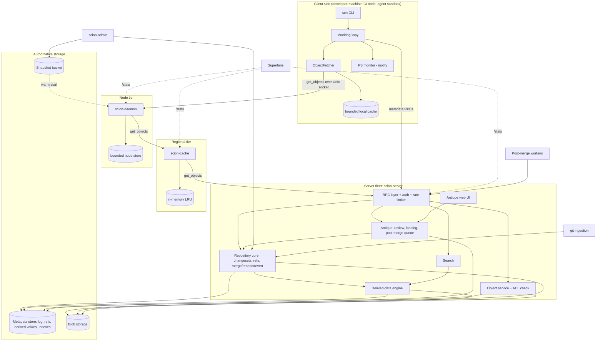
```mermaid
flowchart TB
  subgraph ClientSide["Client side (developer machine, CI node, agent sandbox)"]
    CLI[scn CLI]
    WC[WorkingCopy]
    OF[ObjectFetcher]
    FSM[FS monitor - inotify]
    LC[(bounded local cache)]
    CLI --> WC --> OF --> LC
    WC --> FSM
  end
  subgraph NodeTier["Node tier"]
    DMN[scion-daemon]
    DS[(bounded node store)]
    DMN --> DS
  end
  subgraph RegionTier["Regional tier"]
    CCH[scion-cache]
    MEM[(in-memory LRU)]
    CCH --> MEM
  end
  subgraph ServerTier["Server fleet: scion-server"]
    RPC[RPC layer + auth + rate limiter]
    CORE[Repository core: changesets, refs, merge/rebase/revert]
    DD[Derived-data engine]
    OBJ[Object service + ACL check]
    ANT[Antique: review, landing, post-merge queue]
    SRCH[Search]
    UI[Antique web UI]
    RPC --> CORE & OBJ & ANT & SRCH
    CORE --> DD
    SRCH --> DD
    ANT --> CORE
    UI --> ANT
  end
  subgraph Storage["Authoritative storage"]
    META[(Metadata store: log, refs, derived values, indexes)]
    BLOBS[(Blob storage)]
    SNAP[(Snapshot bucket)]
  end
  WC -- metadata RPCs --> RPC
  OF -- get_objects over Unix socket --> DMN
  DMN -- get_objects --> CCH
  CCH -- get_objects --> RPC
  CORE --> META & BLOBS
  DD --> META & BLOBS
  OBJ --> BLOBS & META
  ANT --> META
  SNAP -. warm start .-> DMN
  ADM[scion-admin] --> CORE & SNAP
  ING[git ingestion] --> CORE
  FAN[Superfans] -. /stats .-> DMN & CCH & RPC
  PM[Post-merge workers] --> RPC
```

## 6.3 Deployment

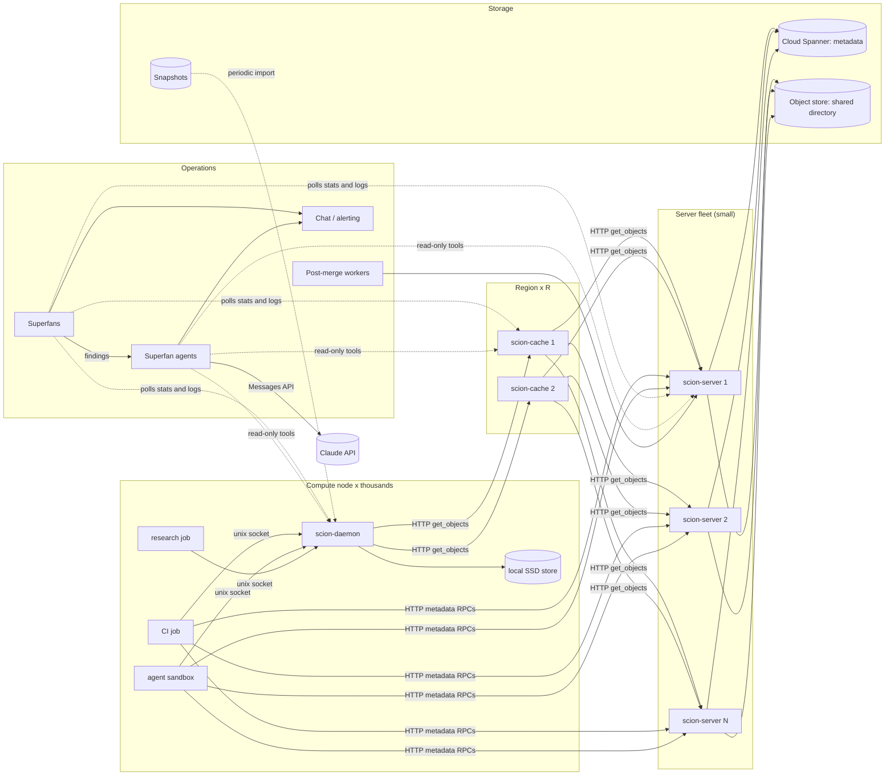
```mermaid
flowchart LR
  subgraph Node["Compute node x thousands"]
    J1[CI job]
    J2[agent sandbox]
    J3[research job]
    D1[scion-daemon]
    SSD[(local SSD store)]
    J1 & J2 & J3 -- unix socket --> D1 --> SSD
  end
  subgraph Region["Region x R"]
    C1[scion-cache 1]
    C2[scion-cache 2]
  end
  subgraph Fleet["Server fleet (small)"]
    S1[scion-server 1]
    S2[scion-server 2]
    S3[scion-server N]
  end
  subgraph Cloud["Storage"]
    SP[(Cloud Spanner: metadata)]
    BS[(Object store: shared directory)]
    SB[(Snapshots)]
  end
  subgraph Ops["Operations"]
    SF[Superfans]
    AG[Superfan agents]
    PMW[Post-merge workers]
    CHAT[Chat / alerting]
  end
  CL[(Claude API)]
  D1 -- HTTP get_objects --> C1 & C2
  C1 & C2 -- HTTP get_objects --> S1 & S2 & S3
  J1 & J2 -- HTTP metadata RPCs --> S1 & S2 & S3
  S1 & S2 & S3 --> SP & BS
  SB -. periodic import .-> D1
  SF -. polls stats and logs .-> D1 & C1 & S1
  SF --> CHAT
  SF -- findings --> AG
  AG -. read-only tools .-> D1 & C1 & S1
  AG -- Messages API --> CL
  AG --> CHAT
  PMW --> S1
```

## 6.4 Packages

Generated from the package's imports (type-only imports left out). Modules without arrows depend on
the standard library alone.

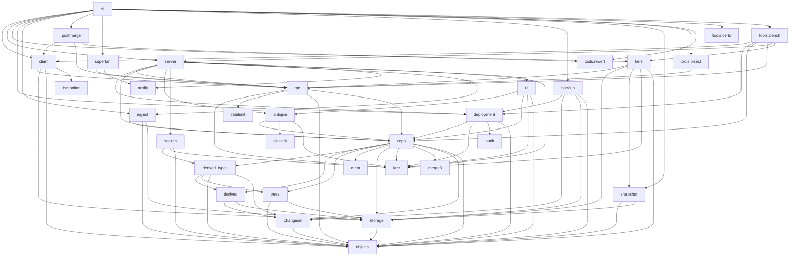
```mermaid
flowchart TB
  storage --> objects
  changeset --> objects
  trees --> objects & storage
  derived --> changeset & storage
  derived_types --> derived & trees & objects & changeset
  repo --> derived & derived_types & trees & meta & storage & iam & merge3 & changeset & objects
  deployment --> repo & iam & audit & objects
  rpc --> iam & ratelimit & objects & repo
  search --> derived_types & iam & objects
  snapshot --> objects & storage
  tiers --> rpc & storage & snapshot & iam & objects
  antique --> repo & classify & iam
  ui --> antique & repo & iam & objects
  server --> rpc & deployment & repo & antique & search & ingest & notify & ui & iam
  client --> rpc & storage & objects & fsmonitor
  ingest --> repo & objects & storage
  backup --> deployment & changeset & storage & objects
  tools_bisect[tools.bisect] --> rpc
  tools_revert[tools.revert]
  tools_certs[tools.certs]
  tools_bench[tools.bench] --> client & deployment & repo & rpc & server & tiers
  postmerge --> client & rpc & tools_revert
  superfan --> rpc & notify
  cli --> client & server & tiers & deployment & ingest & postmerge & superfan & backup & snapshot
  cli --> tools_bisect & tools_revert & tools_certs & tools_bench
```

## 6.5 Design classes

### Server core

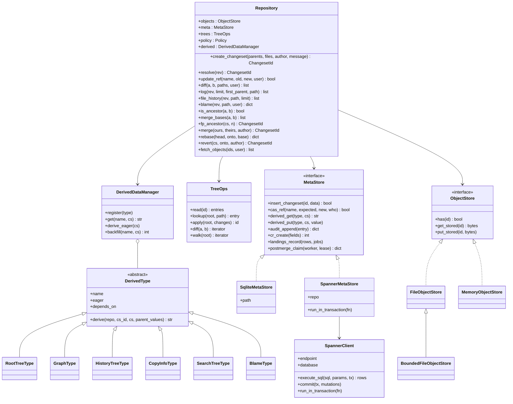
```mermaid
classDiagram
  class Repository {
    +objects : ObjectStore
    +meta : MetaStore
    +trees : TreeOps
    +policy : Policy
    +derived : DerivedDataManager
    +create_changeset(parents, files, author, message) ChangesetId
    +resolve(rev) ChangesetId
    +update_ref(name, old, new, user) bool
    +diff(a, b, paths, user) list
    +log(rev, limit, first_parent, path) list
    +file_history(rev, path, limit) list
    +blame(rev, path, user) dict
    +is_ancestor(a, b) bool
    +merge_bases(a, b) list
    +fp_ancestor(cs, n) ChangesetId
    +merge(ours, theirs, author) ChangesetId
    +rebase(head, onto, base) dict
    +revert(cs, onto, author) ChangesetId
    +fetch_objects(ids, user) list
  }
  class DerivedDataManager {
    +register(type)
    +get(name, cs) str
    +derive_eager(cs)
    +backfill(name, cs) int
  }
  class DerivedType {
    <<abstract>>
    +name
    +eager
    +depends_on
    +derive(repo, cs_id, cs, parent_values) str
  }
  class RootTreeType
  class GraphType
  class HistoryTreeType
  class CopyInfoType
  class SearchTreeType
  class BlameType
  class TreeOps {
    +read(id) entries
    +lookup(root, path) entry
    +apply(root, changes) id
    +diff(a, b) iterator
    +walk(root) iterator
  }
  class MetaStore {
    <<interface>>
    +insert_changeset(id, data) bool
    +cas_ref(name, expected, new, who) bool
    +derived_get(type, cs) str
    +derived_put(type, cs, value)
    +audit_append(entry) dict
    +cr_create(fields) int
    +landings_record(rows, jobs)
    +postmerge_claim(worker, lease) dict
  }
  class SqliteMetaStore {
    +path
  }
  class SpannerMetaStore {
    +repo
    +run_in_transaction(fn)
  }
  class SpannerClient {
    +endpoint
    +database
    +execute_sql(sql, params, tx) rows
    +commit(tx, mutations)
    +run_in_transaction(fn)
  }
  class ObjectStore {
    <<interface>>
    +has(id) bool
    +get_stored(id) bytes
    +put_stored(id, bytes)
  }
  class FileObjectStore
  class BoundedFileObjectStore
  class MemoryObjectStore
  Repository --> DerivedDataManager
  Repository --> TreeOps
  Repository --> MetaStore
  MetaStore <|.. SqliteMetaStore
  MetaStore <|.. SpannerMetaStore
  SpannerMetaStore --> SpannerClient
  Repository --> ObjectStore
  DerivedDataManager o-- DerivedType
  DerivedType <|-- RootTreeType
  DerivedType <|-- GraphType
  DerivedType <|-- HistoryTreeType
  DerivedType <|-- CopyInfoType
  DerivedType <|-- SearchTreeType
  DerivedType <|-- BlameType
  ObjectStore <|.. FileObjectStore
  FileObjectStore <|-- BoundedFileObjectStore
  ObjectStore <|.. MemoryObjectStore
```

### Services and tiers

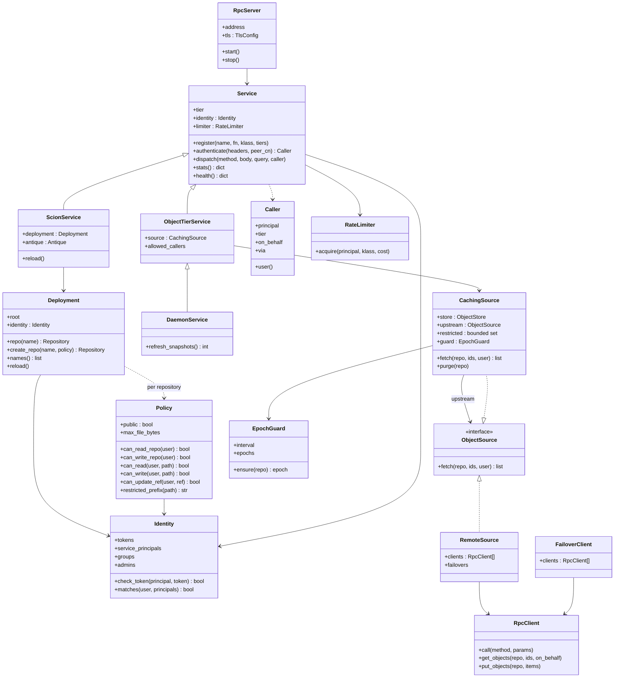
```mermaid
classDiagram
  class Service {
    +tier
    +identity : Identity
    +limiter : RateLimiter
    +register(name, fn, klass, tiers)
    +authenticate(headers, peer_cn) Caller
    +dispatch(method, body, query, caller)
    +stats() dict
    +health() dict
  }
  class ScionService {
    +deployment : Deployment
    +antique : Antique
    +reload()
  }
  class Deployment {
    +root
    +identity : Identity
    +repo(name) Repository
    +create_repo(name, policy) Repository
    +names() list
    +reload()
  }
  class Identity {
    +tokens
    +service_principals
    +groups
    +admins
    +check_token(principal, token) bool
    +matches(user, principals) bool
  }
  class Policy {
    +public : bool
    +max_file_bytes
    +can_read_repo(user) bool
    +can_write_repo(user) bool
    +can_read(user, path) bool
    +can_write(user, path) bool
    +can_update_ref(user, ref) bool
    +restricted_prefix(path) str
  }
  class ObjectTierService {
    +source : CachingSource
    +allowed_callers
  }
  class DaemonService {
    +refresh_snapshots() int
  }
  class ObjectSource {
    <<interface>>
    +fetch(repo, ids, user) list
  }
  class RemoteSource {
    +clients : RpcClient[]
    +failovers
  }
  class CachingSource {
    +store : ObjectStore
    +upstream : ObjectSource
    +restricted : bounded set
    +guard : EpochGuard
    +fetch(repo, ids, user) list
    +purge(repo)
  }
  class EpochGuard {
    +interval
    +epochs
    +ensure(repo) epoch
  }
  class Caller {
    +principal
    +tier
    +on_behalf
    +via
    +user()
  }
  class RateLimiter {
    +acquire(principal, klass, cost)
  }
  class RpcServer {
    +address
    +tls : TlsConfig
    +start()
    +stop()
  }
  class RpcClient {
    +call(method, params)
    +get_objects(repo, ids, on_behalf)
    +put_objects(repo, items)
  }
  class FailoverClient {
    +clients : RpcClient[]
  }
  Service <|-- ScionService
  Service <|-- ObjectTierService
  ObjectTierService <|-- DaemonService
  ObjectTierService --> CachingSource
  ScionService --> Deployment
  Deployment --> Identity
  Deployment ..> Policy : per repository
  Policy --> Identity
  ObjectSource <|.. RemoteSource
  ObjectSource <|.. CachingSource
  CachingSource --> ObjectSource : upstream
  CachingSource --> EpochGuard
  RemoteSource --> RpcClient
  FailoverClient --> RpcClient
  RpcServer --> Service
  Service --> Identity
  Service --> RateLimiter
  Service ..> Caller
```

### Client

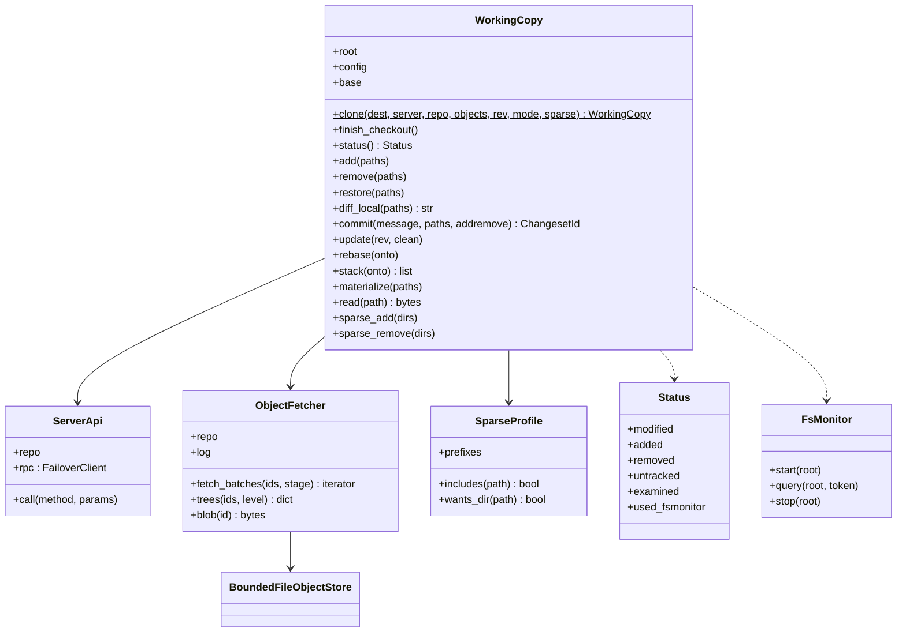
```mermaid
classDiagram
  class WorkingCopy {
    +root
    +config
    +base
    +clone(dest, server, repo, objects, rev, mode, sparse)$ WorkingCopy
    +finish_checkout()
    +status() Status
    +add(paths)
    +remove(paths)
    +restore(paths)
    +diff_local(paths) str
    +commit(message, paths, addremove) ChangesetId
    +update(rev, clean)
    +rebase(onto)
    +stack(onto) list
    +materialize(paths)
    +read(path) bytes
    +sparse_add(dirs)
    +sparse_remove(dirs)
  }
  class ServerApi {
    +repo
    +rpc : FailoverClient
    +call(method, params)
  }
  class ObjectFetcher {
    +repo
    +log
    +fetch_batches(ids, stage) iterator
    +trees(ids, level) dict
    +blob(id) bytes
  }
  class SparseProfile {
    +prefixes
    +includes(path) bool
    +wants_dir(path) bool
  }
  class Status {
    +modified
    +added
    +removed
    +untracked
    +examined
    +used_fsmonitor
  }
  class FsMonitor {
    +start(root)
    +query(root, token)
    +stop(root)
  }
  WorkingCopy --> ServerApi
  WorkingCopy --> ObjectFetcher
  WorkingCopy --> SparseProfile
  WorkingCopy ..> Status
  WorkingCopy ..> FsMonitor
  ObjectFetcher --> BoundedFileObjectStore
```

### Review and landing

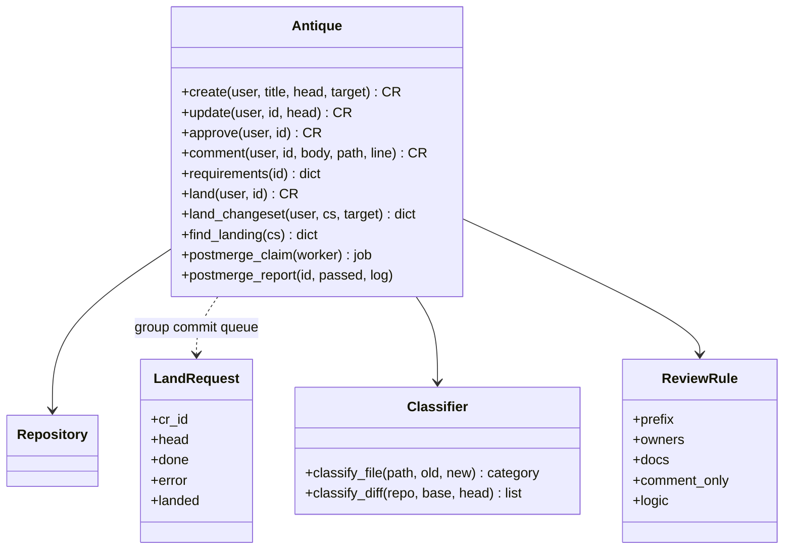
```mermaid
classDiagram
  class Antique {
    +create(user, title, head, target) CR
    +update(user, id, head) CR
    +approve(user, id) CR
    +comment(user, id, body, path, line) CR
    +requirements(id) dict
    +land(user, id) CR
    +land_changeset(user, cs, target) dict
    +find_landing(cs) dict
    +postmerge_claim(worker) job
    +postmerge_report(id, passed, log)
  }
  class LandRequest {
    +cr_id
    +head
    +done
    +error
    +landed
  }
  class Classifier {
    +classify_file(path, old, new) category
    +classify_diff(repo, base, head) list
  }
  class ReviewRule {
    +prefix
    +owners
    +docs
    +comment_only
    +logic
  }
  Antique --> Repository
  Antique ..> LandRequest : group commit queue
  Antique --> Classifier
  Antique --> ReviewRule
```

## 6.6 Sequence diagrams

### Checkout through the tiers (UC-01)

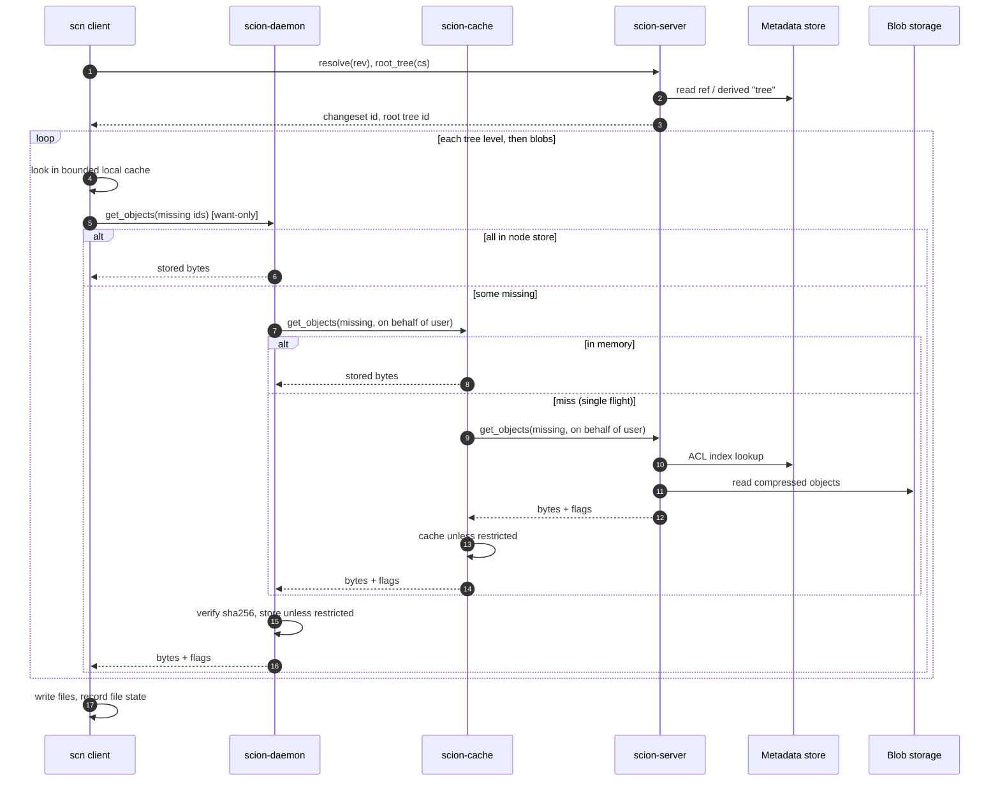
```mermaid
sequenceDiagram
  autonumber
  participant C as scn client
  participant D as scion-daemon
  participant K as scion-cache
  participant S as scion-server
  participant M as Metadata store
  participant B as Blob storage
  C->>S: resolve(rev), root_tree(cs)
  S->>M: read ref / derived "tree"
  S-->>C: changeset id, root tree id
  loop each tree level, then blobs
    C->>C: look in bounded local cache
    C->>D: get_objects(missing ids) [want-only]
    alt all in node store
      D-->>C: stored bytes
    else some missing
      D->>K: get_objects(missing, on behalf of user)
      alt in memory
        K-->>D: stored bytes
      else miss (single flight)
        K->>S: get_objects(missing, on behalf of user)
        S->>M: ACL index lookup
        S->>B: read compressed objects
        S-->>K: bytes + flags
        K->>K: cache unless restricted
        K-->>D: bytes + flags
      end
      D->>D: verify sha256, store unless restricted
      D-->>C: bytes + flags
    end
  end
  C->>C: write files, record file state
```

### Commit (UC-04)

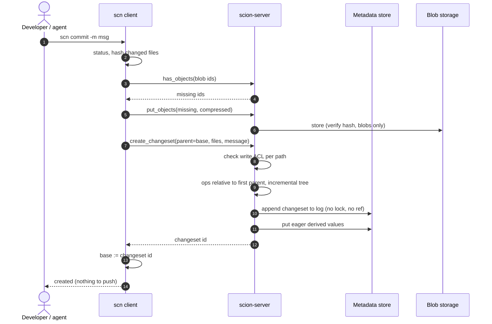
```mermaid
sequenceDiagram
  autonumber
  actor U as Developer / agent
  participant C as scn client
  participant S as scion-server
  participant M as Metadata store
  participant B as Blob storage
  U->>C: scn commit -m msg
  C->>C: status, hash changed files
  C->>S: has_objects(blob ids)
  S-->>C: missing ids
  C->>S: put_objects(missing, compressed)
  S->>B: store (verify hash, blobs only)
  C->>S: create_changeset(parent=base, files, message)
  S->>S: check write ACL per path
  S->>S: ops relative to first parent, incremental tree
  S->>M: append changeset to log (no lock, no ref)
  S->>M: put eager derived values
  S-->>C: changeset id
  C->>C: base := changeset id
  C-->>U: created (nothing to push)
```

### Deferred blame (UC-09)

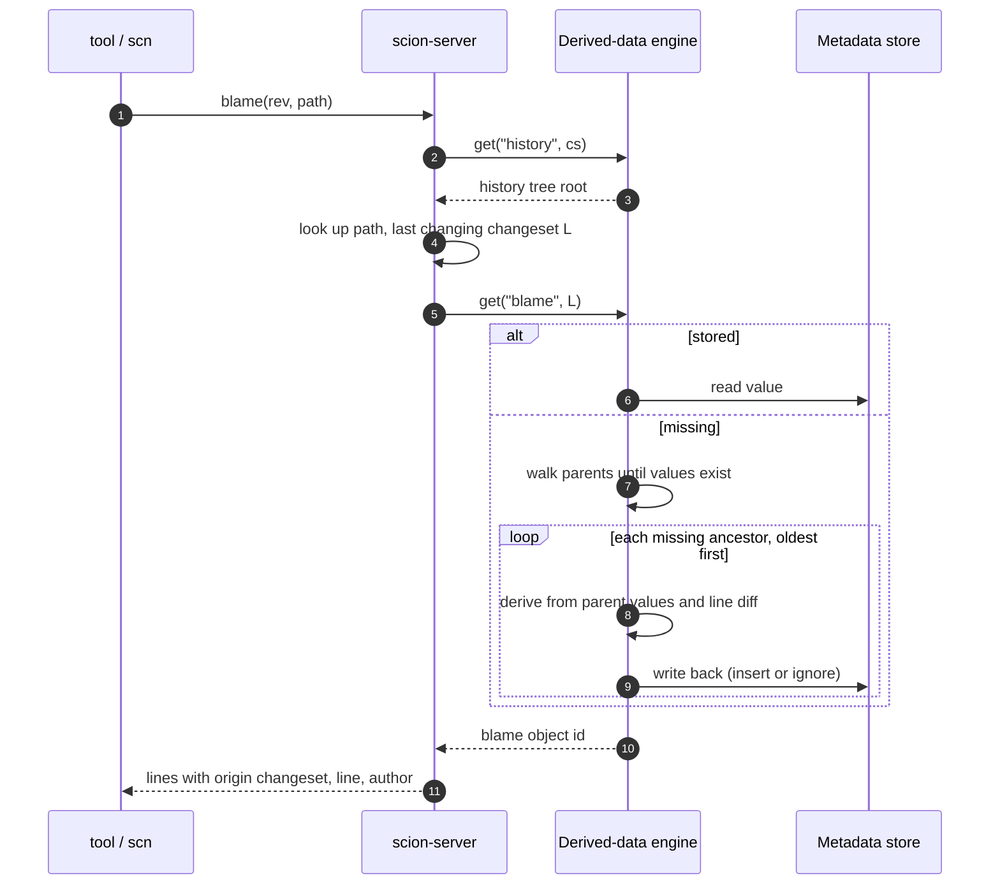
```mermaid
sequenceDiagram
  autonumber
  participant T as tool / scn
  participant S as scion-server
  participant DD as Derived-data engine
  participant M as Metadata store
  T->>S: blame(rev, path)
  S->>DD: get("history", cs)
  DD-->>S: history tree root
  S->>S: look up path, last changing changeset L
  S->>DD: get("blame", L)
  alt stored
    DD->>M: read value
  else missing
    DD->>DD: walk parents until values exist
    loop each missing ancestor, oldest first
      DD->>DD: derive from parent values and line diff
      DD->>M: write back (insert or ignore)
    end
  end
  DD-->>S: blame object id
  S-->>T: lines with origin changeset, line, author
```

### Landing with group commit (UC-15)

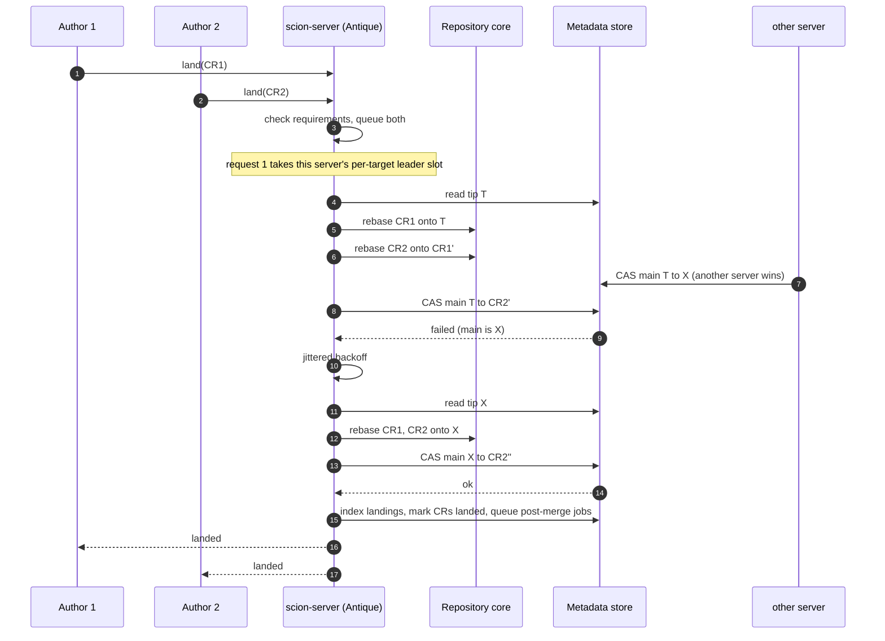
```mermaid
sequenceDiagram
  autonumber
  participant A1 as Author 1
  participant A2 as Author 2
  participant S as scion-server (Antique)
  participant R as Repository core
  participant M as Metadata store
  participant O as other server
  A1->>S: land(CR1)
  A2->>S: land(CR2)
  S->>S: check requirements, queue both
  Note over S: request 1 takes this server's per-target leader slot
  S->>M: read tip T
  S->>R: rebase CR1 onto T
  S->>R: rebase CR2 onto CR1'
  O->>M: CAS main T to X (another server wins)
  S->>M: CAS main T to CR2'
  M-->>S: failed (main is X)
  S->>S: jittered backoff
  S->>M: read tip X
  S->>R: rebase CR1, CR2 onto X
  S->>M: CAS main X to CR2''
  M-->>S: ok
  S->>M: index landings, mark CRs landed, queue post-merge jobs
  S-->>A1: landed
  S-->>A2: landed
```

### Restricted object through shared caches (FR-IAM-04/05)

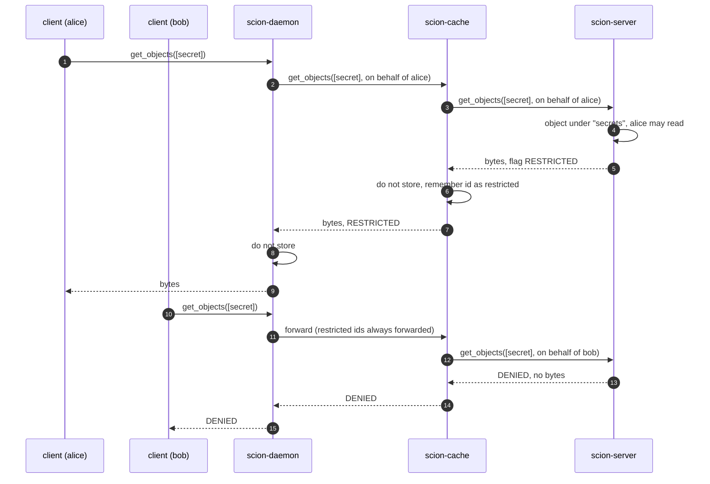
```mermaid
sequenceDiagram
  autonumber
  participant Alice as client (alice)
  participant Bob as client (bob)
  participant D as scion-daemon
  participant K as scion-cache
  participant S as scion-server
  Alice->>D: get_objects([secret])
  D->>K: get_objects([secret], on behalf of alice)
  K->>S: get_objects([secret], on behalf of alice)
  S->>S: object under "secrets", alice may read
  S-->>K: bytes, flag RESTRICTED
  K->>K: do not store, remember id as restricted
  K-->>D: bytes, RESTRICTED
  D->>D: do not store
  D-->>Alice: bytes
  Bob->>D: get_objects([secret])
  D->>K: forward (restricted ids always forwarded)
  K->>S: get_objects([secret], on behalf of bob)
  S-->>K: DENIED, no bytes
  K-->>D: DENIED
  D-->>Bob: DENIED
```

### Post-merge failure and automatic revert (UC-18)

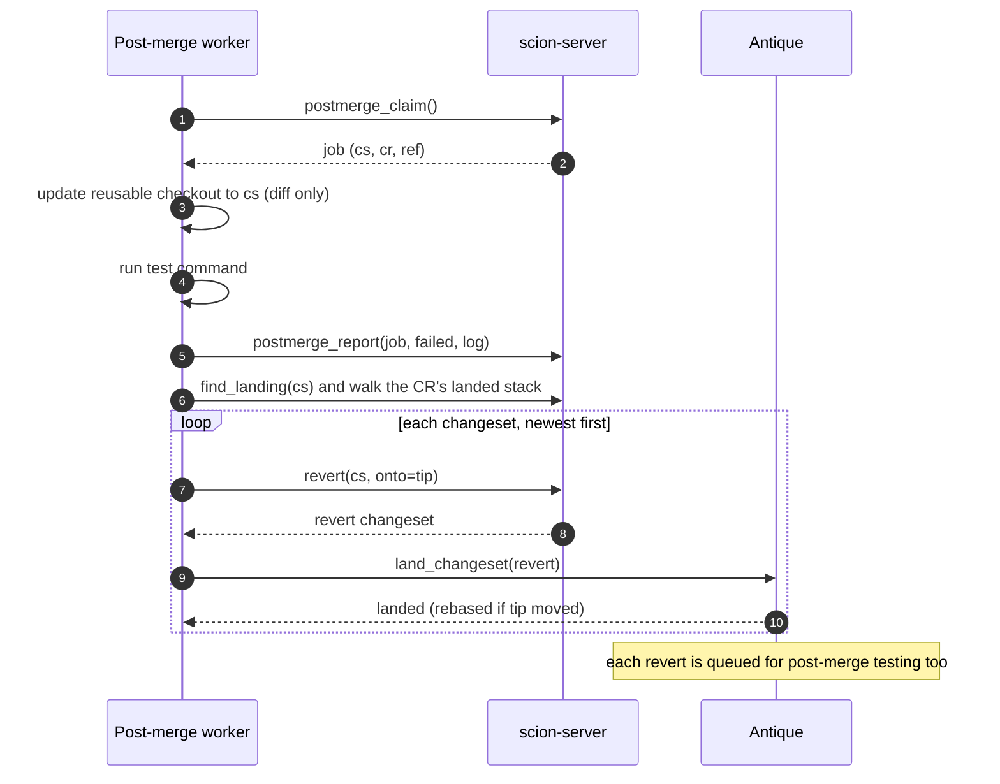
```mermaid
sequenceDiagram
  autonumber
  participant W as Post-merge worker
  participant S as scion-server
  participant A as Antique
  W->>S: postmerge_claim()
  S-->>W: job (cs, cr, ref)
  W->>W: update reusable checkout to cs (diff only)
  W->>W: run test command
  W->>S: postmerge_report(job, failed, log)
  W->>S: find_landing(cs) and walk the CR's landed stack
  loop each changeset, newest first
    W->>S: revert(cs, onto=tip)
    S-->>W: revert changeset
    W->>A: land_changeset(revert)
    A-->>W: landed (rebased if tip moved)
  end
  Note over A: each revert is queued for post-merge testing too
```

### git ingestion (UC-23)

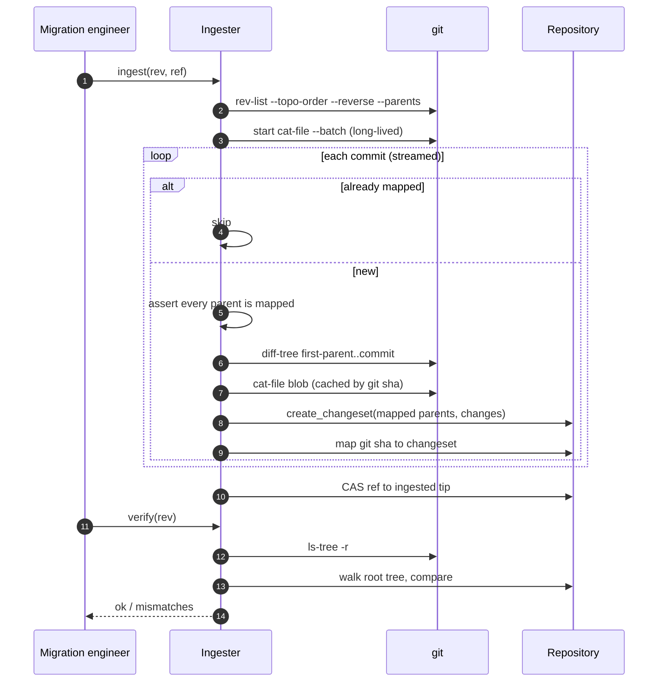
```mermaid
sequenceDiagram
  autonumber
  participant E as Migration engineer
  participant I as Ingester
  participant G as git
  participant R as Repository
  E->>I: ingest(rev, ref)
  I->>G: rev-list --topo-order --reverse --parents
  I->>G: start cat-file --batch (long-lived)
  loop each commit (streamed)
    alt already mapped
      I->>I: skip
    else new
      I->>I: assert every parent is mapped
      I->>G: diff-tree first-parent..commit
      I->>G: cat-file blob (cached by git sha)
      I->>R: create_changeset(mapped parents, changes)
      I->>R: map git sha to changeset
    end
  end
  I->>R: CAS ref to ingested tip
  E->>I: verify(rev)
  I->>G: ls-tree -r
  I->>R: walk root tree, compare
  I-->>E: ok / mismatches
```

### Status with the filesystem monitor (UC-03)

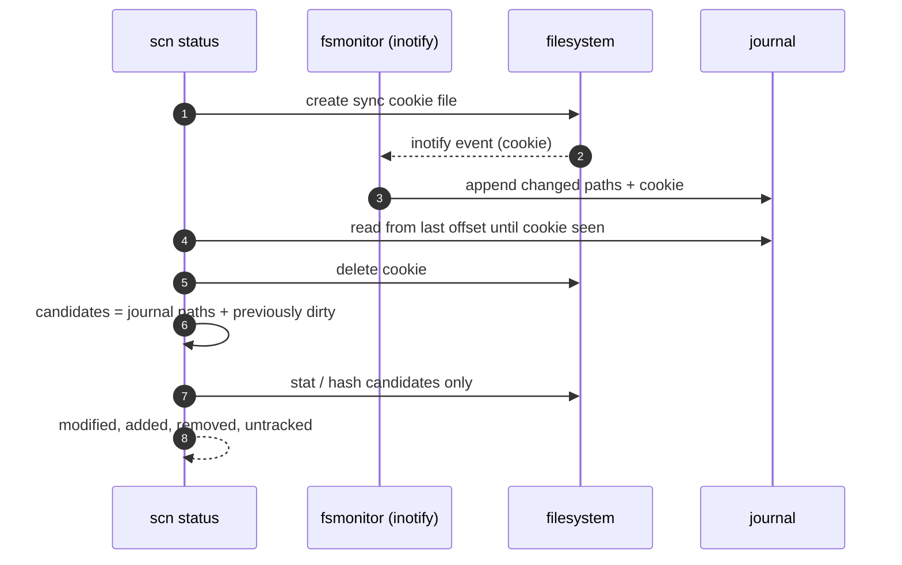
```mermaid
sequenceDiagram
  autonumber
  participant C as scn status
  participant F as fsmonitor (inotify)
  participant FS as filesystem
  participant J as journal
  C->>FS: create sync cookie file
  FS-->>F: inotify event (cookie)
  F->>J: append changed paths + cookie
  C->>J: read from last offset until cookie seen
  C->>FS: delete cookie
  C->>C: candidates = journal paths + previously dirty
  C->>FS: stat / hash candidates only
  C-->>C: modified, added, removed, untracked
```

### Moving a ref on Spanner (FR-ST-01, FR-ST-03)

A compare-and-swap on one ref row, as the article describes, inside a read-write transaction. When
another server's transaction conflicts, Spanner aborts one of them, and the store reruns the whole
transaction function after a short, jittered backoff.

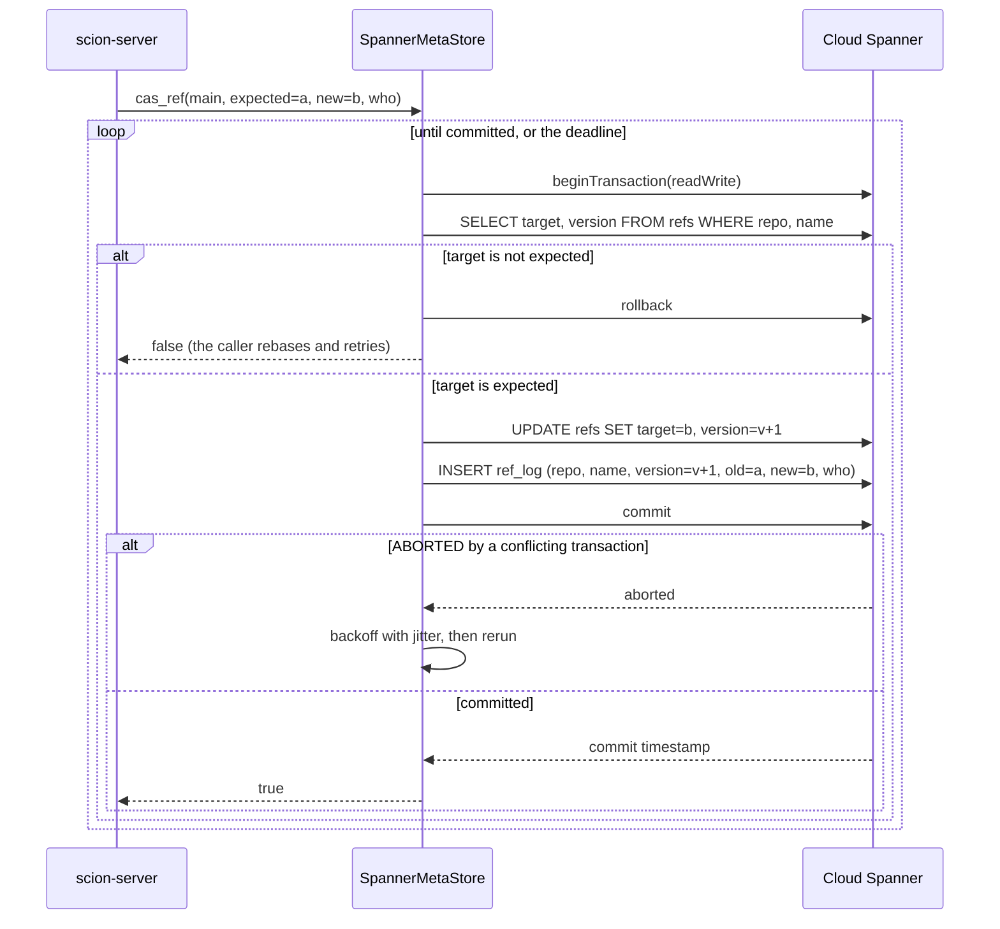
```mermaid
sequenceDiagram
  participant S as scion-server
  participant M as SpannerMetaStore
  participant SP as Cloud Spanner
  S->>M: cas_ref(main, expected=a, new=b, who)
  loop until committed, or the deadline
    M->>SP: beginTransaction(readWrite)
    M->>SP: SELECT target, version FROM refs WHERE repo, name
    alt target is not expected
      M->>SP: rollback
      M-->>S: false (the caller rebases and retries)
    else target is expected
      M->>SP: UPDATE refs SET target=b, version=v+1
      M->>SP: INSERT ref_log (repo, name, version=v+1, old=a, new=b, who)
      M->>SP: commit
      alt ABORTED by a conflicting transaction
        SP-->>M: aborted
        M->>M: backoff with jitter, then rerun
      else committed
        SP-->>M: commit timestamp
        M-->>S: true
      end
    end
  end
```

### A superfan agent investigates a finding (UC-31)

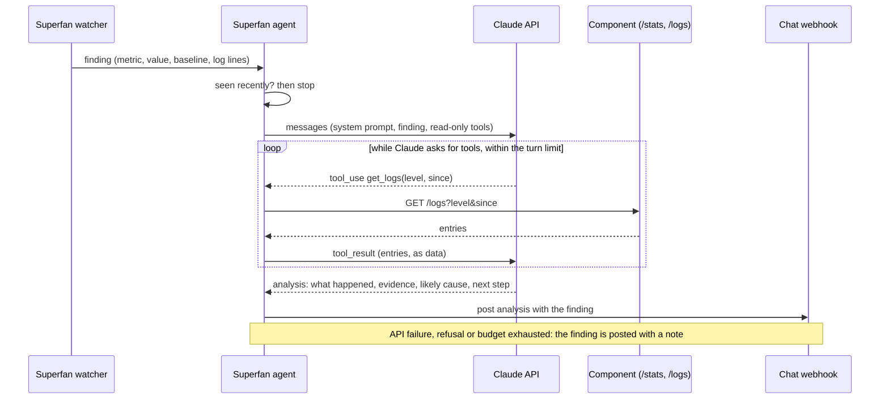
```mermaid
sequenceDiagram
  participant W as Superfan watcher
  participant A as Superfan agent
  participant C as Claude API
  participant X as Component (/stats, /logs)
  participant K as Chat webhook
  W->>A: finding (metric, value, baseline, log lines)
  A->>A: seen recently? then stop
  A->>C: messages (system prompt, finding, read-only tools)
  loop while Claude asks for tools, within the turn limit
    C-->>A: tool_use get_logs(level, since)
    A->>X: GET /logs?level&since
    X-->>A: entries
    A->>C: tool_result (entries, as data)
  end
  C-->>A: analysis: what happened, evidence, likely cause, next step
  A->>K: post analysis with the finding
  Note over A,K: API failure, refusal or budget exhausted: the finding is posted with a note
```

## 6.7 State machines

### Change request

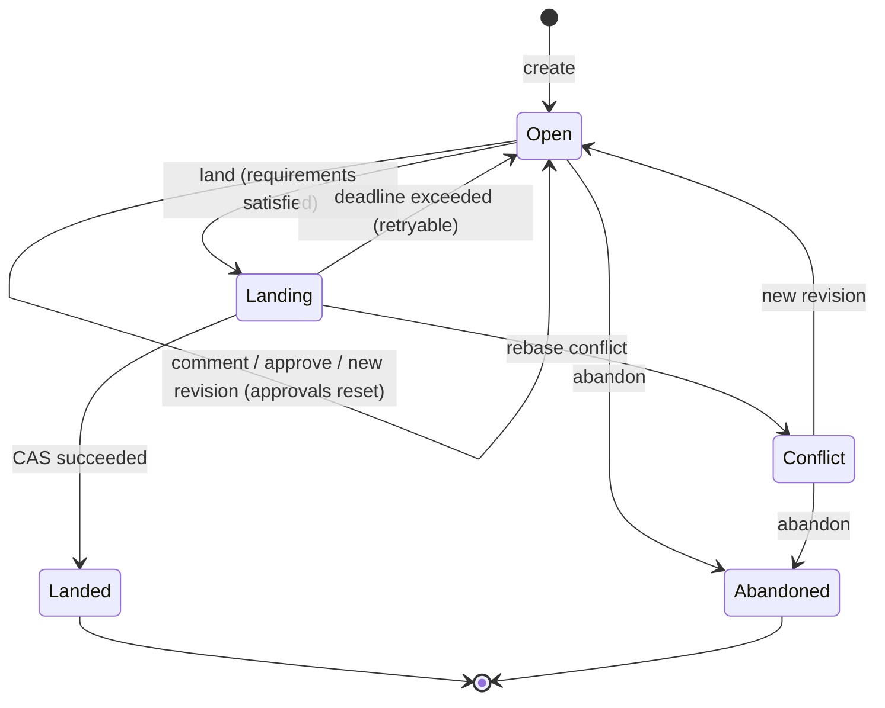
```mermaid
stateDiagram-v2
  [*] --> Open : create
  Open --> Open : comment / approve / new revision (approvals reset)
  Open --> Landing : land (requirements satisfied)
  Landing --> Landed : CAS succeeded
  Landing --> Conflict : rebase conflict
  Landing --> Open : deadline exceeded (retryable)
  Conflict --> Open : new revision
  Open --> Abandoned : abandon
  Conflict --> Abandoned : abandon
  Landed --> [*]
  Abandoned --> [*]
```

### Landing request (inside one server)

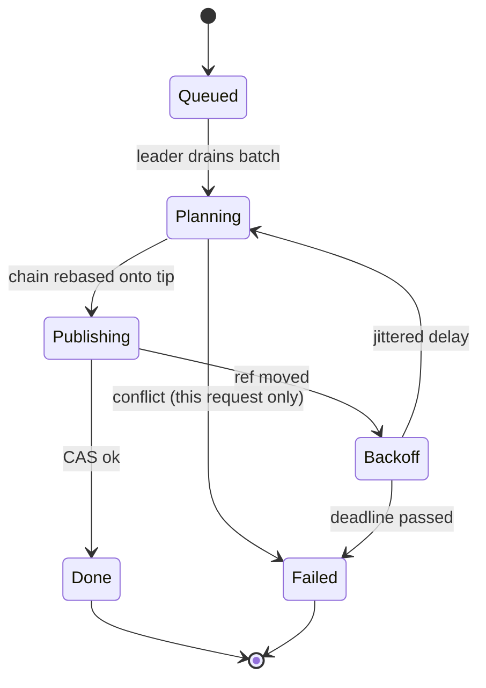
```mermaid
stateDiagram-v2
  [*] --> Queued
  Queued --> Planning : leader drains batch
  Planning --> Failed : conflict (this request only)
  Planning --> Publishing : chain rebased onto tip
  Publishing --> Done : CAS ok
  Publishing --> Backoff : ref moved
  Backoff --> Planning : jittered delay
  Backoff --> Failed : deadline passed
  Done --> [*]
  Failed --> [*]
```

### Post-merge job

```mermaid
stateDiagram-v2
  [*] --> Queued : landing recorded
  Queued --> Running : claimed atomically
  Running --> Passed
  Running --> Failed
  Failed --> Reverted : auto-revert landed
  Passed --> [*]
  Failed --> [*]
  Reverted --> [*]
```

### Working-copy file

```mermaid
stateDiagram-v2
  [*] --> NotMaterialized : virtual checkout
  [*] --> Clean : full or sparse checkout
  NotMaterialized --> Clean : read / materialize
  NotMaterialized --> Modified : written without reading
  [*] --> Untracked : new file
  Untracked --> Added : scn add
  Added --> Clean : commit
  Clean --> Modified : edit
  Modified --> Clean : commit / restore
  Clean --> Removed : delete / scn rm
  Removed --> [*] : commit
```

### Object in a cache tier

```mermaid
stateDiagram-v2
  [*] --> Absent
  Absent --> InFlight : miss (single-flight owner)
  InFlight --> Cached : public object received and verified
  InFlight --> PassThrough : RESTRICTED flag
  InFlight --> Absent : missing / denied / error
  Cached --> Absent : LRU eviction
  PassThrough --> PassThrough : every request forwarded upstream
```

## 6.8 Activity diagrams

### Landing algorithm

```mermaid
flowchart TD
  A([land request]) --> B{requirements satisfied?}
  B -- no --> X[403: list unmet scopes] --> Z([end])
  B -- yes --> C[queue request for target on this server]
  C --> D{got leader slot?}
  D -- no --> E[wait for result] --> Z
  D -- yes --> F[drain queue into a batch]
  F --> G[read tip T]
  G --> H[for each request: fast-forward or rebase onto running head]
  H --> I{conflict?}
  I -- yes --> J[mark CR conflict, fail that request] --> K
  I -- no --> K{more requests?}
  K -- yes --> H
  K -- no --> L{CAS target T to head}
  L -- ok --> M[index landings, mark landed, queue post-merge] --> N{queue empty?}
  N -- no --> F
  N -- yes --> Z
  L -- failed --> O{deadline passed?}
  O -- yes --> P[fail batch as retryable] --> Z
  O -- no --> Q[jittered exponential backoff] --> G
```

### Deriving missing values

```mermaid
flowchart TD
  A([get type T for changeset C]) --> B{value stored?}
  B -- yes --> R([return value])
  B -- no --> C[post-order walk over parents without values]
  C --> D[for each node, oldest first]
  D --> E[derive dependency types first]
  E --> F[read parents' values]
  F --> G[value = T.derive changeset, parent values]
  G --> H[write back: insert or ignore]
  H --> I{more nodes?}
  I -- yes --> D
  I -- no --> R
```

### Status

```mermaid
flowchart TD
  A([scn status]) --> B{fsmonitor running and session unchanged?}
  B -- yes --> C[sync cookie, read journal since token]
  C --> D[candidates = journal + previously dirty]
  B -- no --> E[walk disk within sparse profile]
  D --> F[for each candidate or tracked file]
  E --> F
  F --> G{size and mtime unchanged?}
  G -- yes --> H[clean]
  G -- no --> I[hash content]
  I --> J{blob and kind equal?}
  J -- yes --> K[clean, refresh stat cache]
  J -- no --> L[modified]
  F --> M{untracked on disk?}
  M -- virtual and in tree --> I
  M -- otherwise --> N[untracked unless ignored]
```

## 6.9 Metadata store (ER)

```mermaid
erDiagram
  CHANGESETS {
    int seq PK
    string id UK
    blob data
    float created
  }
  REFS {
    string name PK
    string target FK
    int version
    float updated
  }
  REF_LOG {
    int id PK
    string name
    string old
    string new
    string who
    float at
  }
  DERIVED {
    string type PK
    string cs PK
    string value
  }
  BLOB_INDEX {
    string blob PK
    string path PK
  }
  OBJECT_ACL {
    string object PK
    string prefix PK
  }
  OBJECT_GRANTS {
    string object PK
    string user PK
    float at
  }
  GIT_MAP {
    string git PK
    string cs FK
  }
  CRS {
    int id PK
    string title
    string author
    string target
    string head FK
    string state
    string landed_cs
  }
  CR_REVISIONS {
    int cr PK
    int rev PK
    string head
  }
  CR_APPROVALS {
    int cr PK
    int rev PK
    string user PK
  }
  CR_COMMENTS {
    int id PK
    int cr FK
    int rev
    string path
    int line
    string body
  }
  LANDINGS {
    string cs PK
    string source
    int cr FK
    string ref
    float landed_at
    string head
  }
  AUDIT {
    int seq PK
    float at
    string actor
    string action
    string target
    string detail
    string prev_hash
    string hash
  }
  CONTENT_BLOBS {
    string blob PK
    string status
  }
  CONTENT_TRIGRAMS {
    string trigram PK
    string blob PK
  }
  POSTMERGE {
    int id PK
    string cs FK
    int cr FK
    string ref
    string status
    float started
    string worker
    string log
  }
  REFS }o--|| CHANGESETS : targets
  REFS ||--o{ REF_LOG : history
  CHANGESETS ||--o{ DERIVED : "derived values"
  GIT_MAP }o--|| CHANGESETS : maps
  CRS ||--|{ CR_REVISIONS : has
  CR_REVISIONS ||--o{ CR_APPROVALS : approved
  CRS ||--o{ CR_COMMENTS : has
  CRS ||--o{ LANDINGS : landed
  LANDINGS }o--|| CHANGESETS : "landed as"
  POSTMERGE }o--|| CHANGESETS : tests
  CONTENT_BLOBS ||--o{ CONTENT_TRIGRAMS : "indexed as"
  BLOB_INDEX }o--|| CONTENT_BLOBS : "found at"
```

`CONTENT_BLOBS.status` records how a blob was indexed: its trigrams (`i`), binary (`b`), or too large
to index (`l`, always read by grep). `POSTMERGE.worker` holds the claim token of the worker running
the job; a job `running` for longer than the lease returns to `queued` (T-PM-04).

## 6.10 Metadata store on Spanner (keys and indexes)

One database per deployment. Every table's key starts with the repository, so repositories share
nothing but the database. Keys avoid write hotspots: changeset ids are hashes, the ref log is keyed
by each ref's own version, and the counters behind change-request, comment and job ids see only a
few writes a second. Row contents are those of 6.9.

```mermaid
erDiagram
  CHANGESETS {
    string repo PK
    string id PK
    bytes data
    timestamp created "commit timestamp"
  }
  REFS {
    string repo PK
    string name PK
    string target
    int version
  }
  REF_LOG {
    string repo PK
    string name PK
    int version PK
    string old
    string new
    string who
  }
  DERIVED {
    string repo PK
    string type PK
    string cs PK
    string value
  }
  AUDIT {
    string repo PK
    int seq PK
    string action
    string hash
  }
  CRS {
    string repo PK
    int id PK
    string state
  }
  LANDINGS {
    string repo PK
    string cs PK
    string source
    string head
  }
  POSTMERGE {
    string repo PK
    int id PK
    string status
    string worker
  }
  COUNTERS {
    string repo PK
    string name PK
    int value
  }
  REFS ||--o{ REF_LOG : "one row per version"
  REFS }o--|| CHANGESETS : targets
  CHANGESETS ||--o{ DERIVED : "derived values"
  CRS ||--o{ LANDINGS : landed
  POSTMERGE }o--|| CHANGESETS : tests
  COUNTERS ||--o{ CRS : "allocates ids"
  COUNTERS ||--o{ POSTMERGE : "allocates ids"
```

Secondary indexes: `changesets(repo, created, id)` for the log scan; `audit(repo, action, seq)`;
`crs(repo, state, id)`; `landings(repo, source)` and `landings(repo, head)`;
`postmerge(repo, status, id)` and `postmerge(repo, cs)`; `git_map(repo, cs)`. The other tables of
6.9 (blob and content indexes, object ACLs and grants, key-value settings, review revisions,
approvals and comments) keep their columns, with `repo` added in front of their keys.
